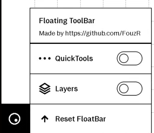
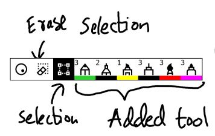
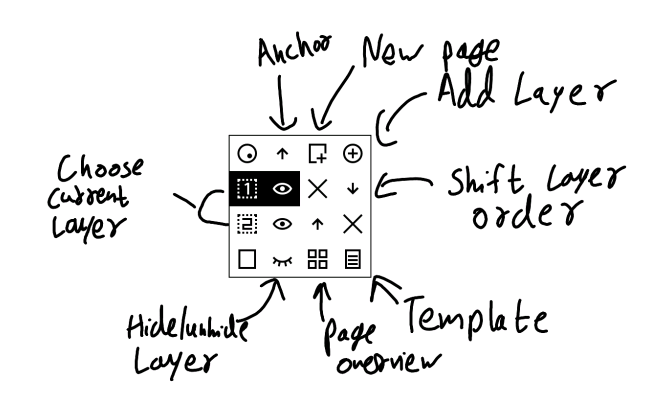
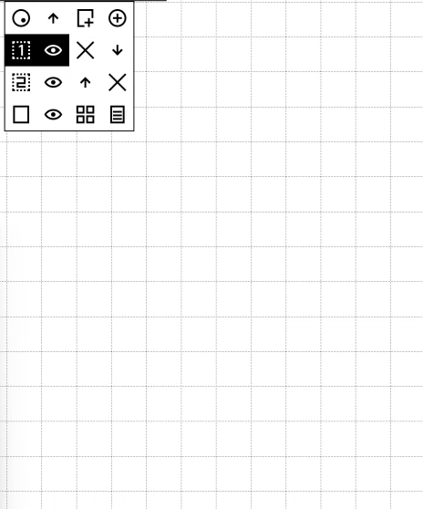

# xovi extensions for the toolbar

The QMD files in this repo add a quicktools-like floating bar, and a layer management bar. Instructions to install xovi can be found in [here](https://github.com/asivery/rmpp-xovi-extensions/blob/master/INSTALL.MD). 
After which, copy the files to 
`/home/root/xovi/exthome/qt-resource-rebuilder/` and restart xovi. The `Edit.qmd` file adds a trash-can icon to the selection helper, which lets the user delete the stroke selected instead of cutting and clearing the clipboard

These QMDs were tested to work in 3.15/16 and 3.17. Please download the respective version of the simplified.qmd file for the versions. Any bugs should be reported in the repo issues. 

## Features

- Allows adding any tool with a preset colour and thickness
- Allows anchoring to the top of the screen
- Can be placed anywhere in the screen
- Can be minimised when not in use

## How-To
To enable the floating toolbars, use the menu in the toolbar
===

## Quick-Tools 
Fully open(Toolbar visible)
===

Partially closed(Toolbar closed)
===

Fully minimised(Double tap the left-most icon)
===

To add Tools
===

To anchor to the top
===

## Layers
Layer-management floating toolbar
===

### Moving the toolbars
Press and hold the left-most icon until it's highlighted. After which, press and drag the icon to move it around
===

